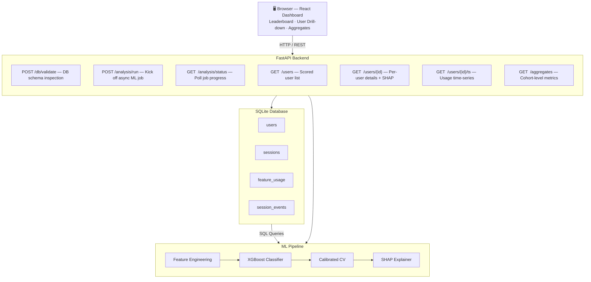

#  ML Churn Predictor

A full-stack web application that predicts user churn probability using machine learning. Upload any compatible SQLite database and the dashboard surfaces at-risk users, ranked by churn likelihood — complete with per-user drill-downs, SHAP-powered feature explanations, and aggregate cohort analytics.
 
---

## 📋 Table of Contents

- [Overview](#overview)
- [Features](#features)
- [Tech Stack](#tech-stack)
- [Architecture](#architecture)
- [Database Schema](#database-schema)
- [ML Model](#ml-model)
- [Getting Started](#getting-started)
- [Project Structure](#project-structure)
- [Development Process](#development-process)
- [Testing & Evaluation](#testing--evaluation)

---

## Overview

Many subscription and engagement-based apps — think language learning platforms, fitness apps, SaaS tools — struggle to retain users and lack proactive tooling to identify at-risk accounts before they churn. This project addresses that gap.

Given a SQLite database of user sessions, the application:

1. Extracts and engineers behavioural features per user from raw session data
2. Trains an **XGBoost** binary classifier on historical usage patterns
3. Scores every user with a calibrated churn probability
4. Exposes results through a **FastAPI** REST backend and a **React** frontend dashboard

The tool is designed to be **database-agnostic** — it validates and introspects any uploaded SQLite file at runtime, requiring only that it conforms to the expected schema.

---

## Features

| Feature | Description |
|---|---|
| 📂 **DB Upload** | Validates and introspects any SQLite database at runtime |
| 🏆 **Risk Leaderboard** | Displays users ranked by churn probability with risk tiers (Low / Medium / High) |
| 🔍 **User Deep Dive** | Per-user panel with usage time-series graph, churn probability score, and top predictive factors |
| 🧠 **SHAP Explanations** | Surfaces the features with highest prediction weight for each individual user |
| 📊 **Cohort Aggregates** | Global view of average metrics and feature importances across all users |
| ⚙️ **Async Job Runner** | Long-running model training/scoring jobs run in the background with live progress updates |
| 🩺 **Health Endpoint** | `/health` route for monitoring and deployment readiness checks |

---

## Tech Stack

**Backend**
- Python 3.13
- FastAPI + Uvicorn (REST API)
- XGBoost (gradient-boosted decision tree classifier)
- Scikit-learn (preprocessing, calibration, evaluation)
- SHAP (model explainability)
- Pandas / NumPy (feature engineering)
- SQLite (data storage via Python `sqlite3`)

**Frontend**
- React (single-page dashboard)
- Served as static files directly from the FastAPI backend

**Dev & Simulation**
- Custom usage simulators (`usageSimulation.py`, `usageSimulation2.py`) generating 500–5,000 synthetic users for development and testing

---

## Architecture



---

## Database Schema

The application expects a SQLite database with the following schema. The `churnLabel` column in `users` is optional — if absent, the model operates in **unsupervised scoring mode**.

```sql
CREATE TABLE users (
    userId     INTEGER PRIMARY KEY,
    churnLabel INTEGER CHECK (churnLabel IN (0, 1))  -- optional ground truth
);

CREATE TABLE sessions (
    sessionId     TEXT    PRIMARY KEY,
    userId        INTEGER NOT NULL,
    sessionDate   INTEGER NOT NULL,   -- Unix timestamp
    sessionLength INTEGER NOT NULL,   -- seconds
    sessionEvents INTEGER NOT NULL,
    FOREIGN KEY (userId) REFERENCES users(userId)
);

CREATE TABLE feature_usage (
    userId      INTEGER NOT NULL,
    sessionId   TEXT    NOT NULL,
    sessionDate INTEGER NOT NULL,
    featureKey  TEXT    NOT NULL,
    count       INTEGER NOT NULL DEFAULT 1,
    FOREIGN KEY (userId)    REFERENCES users(userId),
    FOREIGN KEY (sessionId) REFERENCES sessions(sessionId)
);

CREATE TABLE session_events (          -- reserved for future expansion
    eventId    TEXT PRIMARY KEY,
    sessionId  TEXT NOT NULL,
    userId     INTEGER NOT NULL,
    eventTime  TEXT,
    eventType  TEXT,
    featureKey TEXT
);
```

---

## ML Model

### Feature Engineering

Raw session records are transformed into a rich per-user feature vector:

- **Recency** — days since last session, exponentially decayed activity weight (`half_life = 14 days`)
- **Frequency** — session counts over rolling windows of 7, 14, and 30 days
- **Engagement depth** — average session length, average events per session
- **Drop-off signal** — activity ratio in the most recent 14-day window vs. historical baseline
- **Feature breadth** — distinct feature keys used per session (from `feature_usage`)

### Training Strategy

The model uses a **temporal split**: the first 80% of each user's session history is used to build training features and labels, while the most recent 20% forms the prediction window. This mirrors real-world deployment where past behaviour is used to predict future churn.

### Model Configuration

| Parameter | Default |
|---|---|
| Classifier | `XGBClassifier` + `CalibratedClassifierCV` |
| Churn threshold | `0.40` |
| High-risk threshold | `0.70` |
| Activity half-life | `14 days` |
| Drop-off window | `14 days` |
| Rolling windows | `7, 14, 30 days` |
| Random state | `42` |

### Explainability

[SHAP (SHapley Additive exPlanations)](https://shap.readthedocs.io/) values are computed for every scored user, enabling the dashboard to show *why* a particular user is flagged — not just their probability score.

---

## Getting Started

### Prerequisites

- Python 3.10+
- Node.js (only if rebuilding the frontend from source)

### Installation

```bash
# 1. Clone the repository
git clone https://github.com/your-username/ai-churn-predictor.git
cd ai-churn-predictor

# 2. Install Python dependencies
pip install -r requirements.txt
```

### Generate a Sample Database (Optional)

The repo includes two usage simulators for local development and testing:

```bash
# Small simulation — ~500 users (fast)
python -c "from saveToDb import save_to_db; save_to_db()"

# Medium simulation — ~5,000 users (recommended)
python -c "from saveToDb2 import save_to_db2; save_to_db2()"
```

This creates `app_usage.db` in the project root.

### Run the Application

```bash
# Start the FastAPI backend (serves both API + React frontend)
uvicorn backend.app:app --reload --port 8000
```

Then open your browser at:

```
http://localhost:8000/ui
```

Upload a database file using the dashboard UI to kick off the analysis.

---

## Project Structure

```
ai-churn-predictor/

  backend/
    app.py                   FastAPI routes and app entry point
    db/
      sessions.py            Time-series query helpers
      sqlite_validate.py     DB schema validation and introspection
      windows.py             Observation window derivation
    explain/
      shap_explain.py        SHAP value computation and top-factor extraction
    features/
      feature_frame.py       Feature engineering pipeline
    jobs/
      runner.py              Async background job runner
      store.py               In-memory job state store
    model/
      train_and_score.py     XGBoost training, calibration and scoring
    schemas/
      api.py                 Pydantic request/response models

  frontend/
    index.html               React dashboard (single-file build)

  usageSimulation.py         Simulator v1 - 500 users
  usageSimulation2.py        Simulator v2 - 5,000 users
  saveToDb.py                Saves sim v1 output to SQLite
  saveToDb2.py               Saves sim v2 output to SQLite
  collectAndPredict.py       Legacy standalone prediction runner
  dbConfig.py                Database path configuration
  schema.sql                 Reference DB schema
  main.py                    Legacy entry point
  requirements.txt
```

---

## Development Process

This project was built following a structured **Software Development Life Cycle (SDLC)**:

| Phase | Activities |
|---|---|
| **1. Planning** | Identified the business problem: high churn rates in engagement apps with no proactive tooling to address them |
| **2. Requirements** | Defined scope — a self-contained local app that accepts any conforming SQLite DB and outputs ranked churn predictions |
| **3. Design** | Selected the tech stack, designed the relational schema, planned feature engineering strategy and ML training approach |
| **4. Development** | Built usage simulator → SQLite ingestion → feature pipeline → XGBoost model → FastAPI backend → React frontend |
| **5. Testing** | Evaluated model with Scikit-learn metrics; debugged API endpoints; validated edge-case DB inputs |

---

## Testing & Evaluation

The ML model is evaluated using standard binary classification metrics from Scikit-learn:

```python
from sklearn.metrics import roc_auc_score, accuracy_score, f1_score
```

| Metric | Description |
|---|---|
| **ROC-AUC** | Measures classifier's ability to discriminate churners from non-churners |
| **Accuracy** | Fraction of correct predictions on the held-out test split |
| **F1 Score** | Harmonic mean of precision and recall — robust to class imbalance |

Model calibration is applied via `CalibratedClassifierCV` (Scikit-learn) to ensure predicted probabilities are reliable and well-calibrated, not just ordinally ranked.

---

## Skills Demonstrated

`Machine Learning` · `XGBoost` · `SHAP Explainability` · `Python` · `Pandas` · `NumPy` · `Scikit-learn` · `SQL` · `SQLite` · `FastAPI` · `REST API Design` · `React` · `Relational Databases` · `Feature Engineering` · `Software Development Lifecycle` · `Backend Development` · `Business Analysis` · `Data Simulation` · `Git & GitHub`

---

## License

This project is licensed under the MIT License. See [LICENSE](LICENSE) for details.

---

*Built by [Ryan Vandersar](https://github.com/your-username)*
